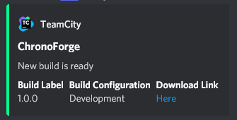

# Send-DiscordWebhook

## Input

- A **file.json** with below structure, [reference](https://discohook.org/)
- Pass to powershell as variable with `$WebhookContent = Get-Content file.json -Raw`
```json
{
  "embeds": [
    {
      "color": "65423",
      "title": "%GameName%",
      "description": "New build is ready",
      "author": {
        "name": "TeamCity",
        "icon_url": "https://raw.githubusercontent.com/tcplugins/tcWebHooks/master/docs/icons/teamcity-logo-48x48.png"
      },
      "fields": [
        {
          "inline": "true",
          "name": "Build Label",
          "value": "%BuildLabel%"
        },
        {
          "inline": "true",
          "name": "Build Configuration",
          "value": "%BuildConfiguration%"
        },
        {
          "inline": "true",
          "name": "Download Link",
          "value": "[Here]()"
        }
      ]
    }
  ]
}
```

- Or use powershell to programmatically construct the json
```ps1
$Fields = @(
  @{
    name   = 'Build Label'
    value  = '%BuildLabel%'
    inline = 'true'
  },
  @{
    name   = 'Build Configuration'
    value  = '%BuildConfiguration%'
    inline = 'true'
  },
  @{
    name   = 'Download Link'
    value  = "[Here]($S3PresignedUrl)"
    inline = 'true'
  }
)

$WebhookContent = @{
  embeds = @(
    @{
      title       = $Title
      description = $Description
      color       = $Color
      fields      = @($Fields)
      author      = @{
        name     = $AuthorName
        icon_url = $AuthorIconUrl
      }
      thumbnail   = @{
        url = $ThumbnailUrl
      }
    }
  )
} | ConvertTo-Json -Depth 4
```

## Output

